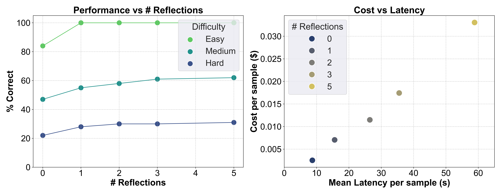

## Experimnental Results

The tradeoff between accuracy, latency, and cost is crucial for selecting an inference strategy. Each task or problem domain is likely to have a unique profile, but we can use this math benchmark as a rough guideline as shown below.

* For Easy tasks, you can achieve a ~ 20% performance increase with 2.8x increased cost and 1.8x increased latency.
* For Medium tasks, you can achieve a ~ 30% performance increase with 7x increased cost and 4x increased latency.
* For Hard tasks, you can achieve a ~ 27% increase in performance with 2.8x increased cost and 1.8x increased latency.

    

The hyperparameter optimisation functionality allows you to search the space of possible inference options and understand this tradeoff profile for your problem. This helped us discover that, on the Arithmetic (Medium) task, Claude 3 Haiku outperforms Claude 3 Sonnet when both use 3 rounds of self-reflection.

> This allows us to save over 10x on cost and 3x on latency per request!

    

