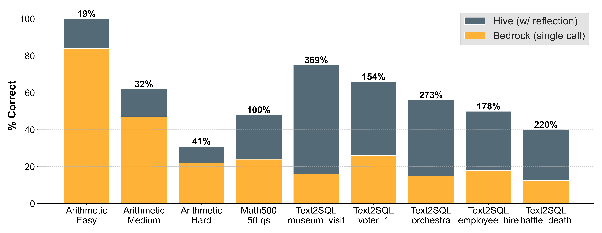
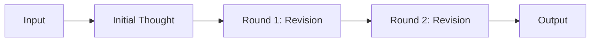
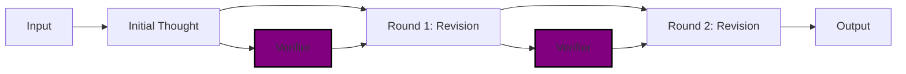
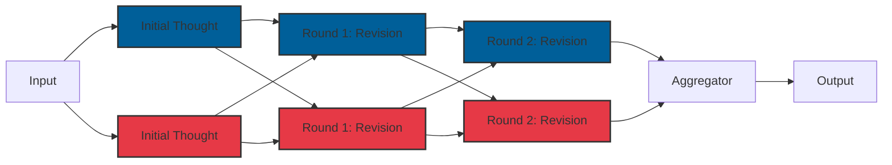
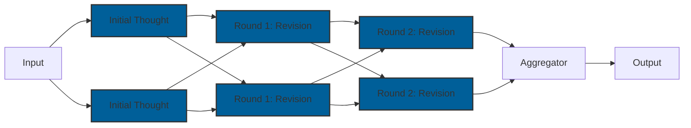
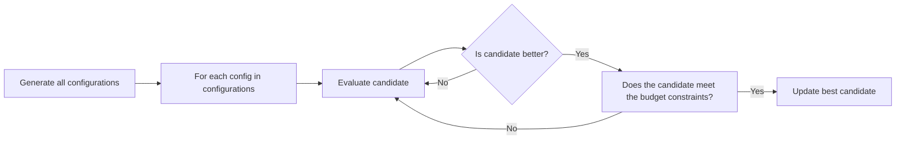

# 🐝 GenAI Reflection for Bedrock

A configurable extension to Bedrock which enhances performance by enabling additional compute at inference time, allowing you to tradeoff the cost, accuracy and latency of a Bedrock solution using the following features:

* **Reflection** - Enables models to iteratively refine their responses through multiple rounds of self-reflection with external verification systems
* **Multi-Model** - Supports parallel inference across multiple Bedrock models for collaborative problem solving with aggregated responses
* **Prompt Caching** - Caches model responses to avoid redundant API calls and reduce costs
* **Structured Outputs** - Validates and formats model outputs into consistent structured data
* **Budget Optimisation** - Automatically searches for the optimal inference-time configuration considering cost and latency constraints

We have seen significant performance gains over a single Bedrock call for a wide range of domains using these techniques as shown below:

<p align="center" width="100%">
    
</p>

> See [task details](./examples/benchmarks/) and [expanded evaluation results](./EXPERIMENTS.md) for more information!

## 📦 Installation

After cloning this repository you can run the following inside a virtual environment:

```
pip install .
```

## 💬 Usage

There are a variety of ways to leverage this in your project:

### 1) Using a Single Model

Now that you've setup the `Hive` client, the easiest way to leverage it in your project is with a single model and an optional number of reflection rounds as shown below. This configuration enables the model to reflect on its' response and apply more compute to solving a more difficult problem.



```python
from bhive import Hive, HiveConfig

bhive_client = Hive()
bhive_config = HiveConfig(
    bedrock_model_ids=["anthropic.claude-3-sonnet-20240229-v1:0"],
    num_reflections=2,
)
messages = [{"role": "user", "content": [{"text": "What is 2 + 2?"}]}]
response = bhive_client.converse(messages, bhive_config)
print(response)
```

### 2) Using a Verifier

You can also optionally pass a `verifier` function to the `HiveConfig` which consumes a model output from a previous round of reflection and should return additional context about that response which allows the integration of external information. The `verifier` must be a `Callable` which consumes a single `str` and outputs another `str`.



```python
from bhive import Hive, HiveConfig

bhive_client = Hive()

def twoplustwo_verifier(context: str) -> str:
    if "4" in context:
        return "this answer is correct"
    else:
        return "this answer is wrong"

bhive_config = HiveConfig(
    bedrock_model_ids=["anthropic.claude-3-sonnet-20240229-v1:0"],
    num_reflections=2,
    verifier=twoplustwo_verifier
)

messages = [{"role": "user", "content": [{"text": "What is 2 + 2?"}]}]
response = bhive_client.converse(messages, bhive_config)
print(response)
```

There are often cases where additional context can be used to help steer the model during a problem solving iteration. For example, in a text-to-code application, such as text-to-SQL, a `verifier` can execute the SQL and return some additional information about runtime errors or data as shown below.

```python
def text2sql_verifier(context: str) -> str:
    """Extracts SQL and validates it against a database."""
    extracted_sql_query = extract_sql(context, "<SQL>")

    try:
        result = execute_sql(db_path=db_path, sql=extracted_context[0])
        result_df = pd.DataFrame(result)
        base_msg = "The query was executed successfully against the database."
        if not result_df.empty:
            return f"{base_msg} It returned the following results:\n{result_df.to_string(index=False)}"
        else:
            return f"{base_msg} It returned no results."
    except Exception as e:
        return f"Error executing the SQL query: {str(e)}"
```

### 3) Using Multiple Models

You can also incorporate multiple different Bedrock models to collaboratively try to solve your task. In order to use this functionality you need to provide an `aggregator_model_id` which performs the role of summarising the last debate round into a final response. The example code below would implement the following inference method where <span style="color: #005f99;">blue</span> signifies a Claude response and <span style="color: #e63946;">red</span> a response from Mistral.



```python
from bhive import Hive, HiveConfig

bhive_client = Hive()

models = ["anthropic.claude-3-sonnet-20240229-v1:0", "mistral.mistral-large-2402-v1:0"]
bhive_config = HiveConfig(
    bedrock_model_ids=models,
    num_reflections=2,
    aggregator_model_id="anthropic.claude-3-sonnet-20240229-v1:0"
)

messages = [{"role": "user", "content": [{"text": "What is 2 + 2?"}]}]
response = bhive_client.converse(messages, bhive_config)
print(response)
```

This can also be done with multiple instances of the same model by modifying the list as shown in the diagram and code below:



```python
from bhive import Hive, HiveConfig

bhive_client = Hive()

models = ["anthropic.claude-3-sonnet-20240229-v1:0", "anthropic.claude-3-sonnet-20240229-v1:0"]
bhive_config = HiveConfig(
    bedrock_model_ids=models,
    num_reflections=2,
    aggregator_model_id="anthropic.claude-3-sonnet-20240229-v1:0"
)

messages = [{"role": "user", "content": [{"text": "What is 2 + 2?"}]}]
response = bhive_client.converse(messages, bhive_config)
print(response)
```

You can also apply the verifier from the previous stage in this inference method, applying it independently to each revision from each model.

### 4) Optimisation

If you are not sure which exact hyperparameter configuration will suit your needs, you can use the hyperparameter optimisation functionality. Here, you can define a set of ranges for the inference parameters such as the Bedrock models or rounds of reflection and these will be evaluated for against a test dataset. You can also specify a budget constraining the maximum cost ($) and maximum latency (seconds) per example.



An example implementation in the API is shown below:

```python
# craft a test dataset of prompt, response pairs
dataset = [
    ("What is the capital of France?", "Paris"),
    ("What is 2 + 2?", "4"),
    ("Who wrote Hamlet?", "William Shakespeare")
]

# define a configuration of models and reflections rounds
trial_config = TrialConfig(
    bedrock_model_combinations=[
        ["anthropic.claude-3-sonnet-20240229-v1:0"],
        ["anthropic.claude-3-haiku-20240307-v1:0"],
        ["mistral.mistral-small-2402-v1:0"],
        ["mistral.mistral-large-2402-v1:0"],
    ],
    reflection_range=[0, 1, 3],
    # other parameter ranges / choices
)

# instantiate a client and run optimise
hive_client = Hive()
results = hive_client.optimise(dataset, trial_config)
```

> By default `Hive.optimise` will directly compare string responses but you can pick from (and extend) other evaluators available in `bhive.evaluators`.

## 🤝 Contributor Guidelines

### Team

|  |  |
|----|----|
| [Jack Butler](https://www.linkedin.com/in/jackbutler-a/) | [Nikita Kozodoi](https://www.linkedin.com/in/kozodoi/) |

Chat to the team if you have new feature suggestions or bug fixes!

## FAQs

1. Can I use this with any model on Bedrock?
> The model must support conversation history to be used, this rules out certain models such as `Jurassic-2 Ultra` which do not have this capability.

2. Does it support multimodal queries?
> Yes, it mirrors the BedrockRuntime `converse()` messages structure and will perform inference with any modality.

3. Can I authenticate with my own `boto3` client?
> Yes, you can pass an already initialised client instance to the `Hive` class, otherwise we will try to create a client from the `AWS_PROFILE` environment variable.
