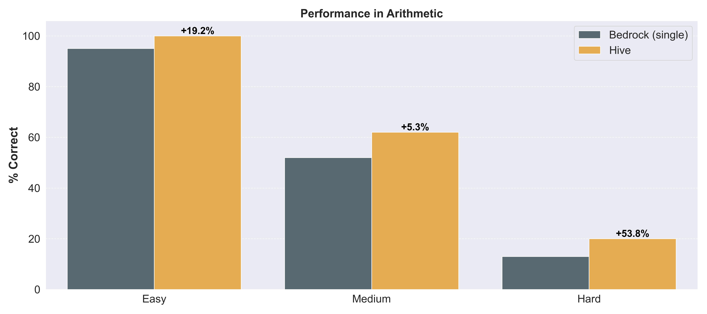
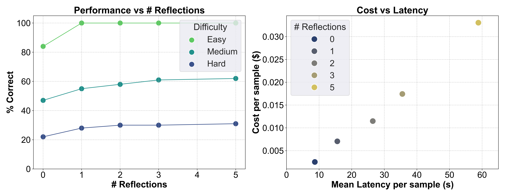
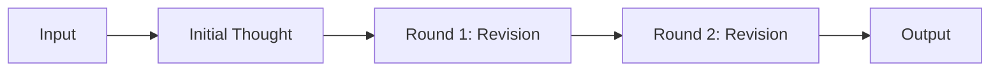
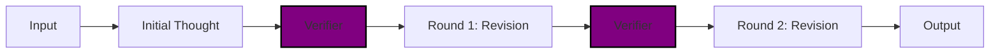
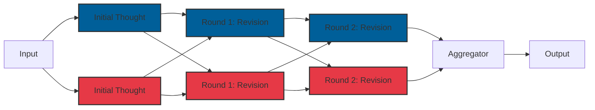

# 🐝 BedrockHive

A configurable extension to Bedrock text generation that enhances reasoning capabilities by enabling additional compute at test time. We have shown that by leveraging up to 5 rounds of BedrockHive self-reflection you can achieve an +40% increase in complex mathematical reasoning performance on the Arithmetic benchmark described [here](./examples/benchmarks/arithmetic/notes.txt).

<p align="center" width="100%">
    
</p>

The relationship between accuracy, latency, and cost is crucial for selecting a sampling strategy. Each task or problem domain is likely to have a unique profile, but we can use this specific arithmetic benchmark as a rough guideline. For this task, we see that increasing the number of times a model reflects on its answer provides a performance boost, particularly for harder tasks. Additionally, both latency and cost increase linearly with the number of reflection rounds, as self-reflection maintains a relatively constant number of output tokens, thereby mitigating significant additional costs. Using BedrockHive, users can configure the number of reflection rounds based on the difficulty level and dynamically allocate more compute resources to more challenging problems. However, if they are particularly focused on easier tasks, they can choose whether to spend $3.50 for 80% accuracy or $7.00 for 100% accuracy, depending on their task.

<p align="center" width="100%">
    
</p>

> There are more evaluations ongoing for other tasks, please reach out if you have a specific task of interest!

## 📦 Installation

Follow the [package registry guidance](https://quip-amazon.com/DHVAAHndixT7/GitLab-Package-Registry) to setup a local `pip` configuration for installing GitLab packages.

Then install the library:
```bash
pip install bedrock_hive
```

## 💬 Usage

There are a variety of ways to leverage BedrockHive in your project:

### Client Configuration

Initially, you have to provide BedrockHive with a way of connecting to a bedrock runtime client. You can provide a `botocore.config.Config` and the `Hive` class will create a client from your `AWS_PROFILE` environment variable as shown below:


```python
from botocore.config import Config
from bhive import Hive, HiveConfig

client_config = Config(region_name="us-east-1", retries={"max_attempts": 5})
bhive_client = Hive(client_config=client_config)
```

> You can also create your own custom `boto3` bedrock runtime client and pass that directly to the `Hive` class.

### 1) Using a Single Model

Now that you've setup the `Hive` client, the easiest way to leverage it in your project is with a single model and an optional number of reflection rounds as shown below. This configuration enables the model to reflect on its' response and apply more compute to solving a more difficult problem.



```python
from bhive import HiveConfig

bhive_config = HiveConfig(
    bedrock_model_ids=["anthropic.claude-3-sonnet-20240229-v1:0"],
    num_reflections=2,
)

response = bhive_client.converse("What is 2 + 2?", bhive_config)
print(response)
```

### 2) Using a Verifier

You can also optionally pass a `verifier` function to the `HiveConfig` which consumes a model output from a previous round of reflection and should return additional context about that response which allows the integration of external information. The `verifier` must be a `Callable` which consumes a single `str` and outputs another `str`.



```python
from bhive import HiveConfig

def twoplustwo_verifier(context: str) -> str:
    if "4" in context:
        return "this answer is correct"
    else:
        return "this answer is wrong"

bhive_config = HiveConfig(
    bedrock_model_ids=["anthropic.claude-3-sonnet-20240229-v1:0"],
    num_reflections=2,
    verifier=twoplustwo_verifier
)

response = bhive_client.converse("What is 2 + 2?", bhive_config)
print(response)
```

There are often cases where additional context can be used to help steer the model during a problem solving iteration. For example, in a text-to-code application, such as text-to-SQL, a `verifier` can execute the SQL and return some additional information about runtime errors or data as shown below.

```python
def text2sql_verifier(context: str) -> str:
    """Extracts SQL and validates it against a database."""
    extracted_sql_query = extract_sql(context, "<SQL>")

    try:
        result = execute_sql(db_path=db_path, sql=extracted_context[0])
        result_df = pd.DataFrame(result)
        base_msg = "The query was executed successfully against the database."
        if not result_df.empty:
            return f"{base_msg} It returned the following results:\n{result_df.to_string(index=False)}"
        else:
            return f"{base_msg} It returned no results."
    except Exception as e:
        return f"Error executing the SQL query: {str(e)}"
```

### 3) Using Multiple Models

You can also incorporate multiple different Bedrock models to collaboratively try to solve your task. In order to use this functionality you need to provide an `aggregator_model_id` which performs the role of summarising the last debate round into a final response. The example code below would implement the following inference method where <span style="color: #005f99;">blue</span> signifies a Claude response and <span style="color: #e63946;">red</span> a response from Mistral.



```python
from bhive import HiveConfig

models = ["anthropic.claude-3-sonnet-20240229-v1:0", "mistral.mistral-large-2402-v1:0"]
bhive_config = HiveConfig(
    bedrock_model_ids=models,
    num_reflections=2,
    aggregator_model_id="anthropic.claude-3-sonnet-20240229-v1:0"
)

response = bhive_client.converse("What is 2 + 2?", bhive_config)
print(response)
```

You can also apply the verifier from the previous stage in this inference method, applying it independently to each revision from each model.

## 🧪 Live Playground

**TBC**

## 🤝 Contributors

### Guidelines

Chat to [`@jackbtlr`](https://phonetool.amazon.com/users/jackbtlr) if you have feature suggestions, bugs or thoughts on improving `BedrockHive`!

### Tooling

We use `uv`, a fast rust-based python tool for managing dependencies. Although you don't have to use `uv` for working on this package, I recommend you try it out and read more on [their website](https://docs.astral.sh/uv/).

Some convenient example commands are;

```bash
uv python install / list / uninstall # for handling python versions

uv add / remove / sync / lock # for handling python dependencies

uv run example.py # for running scripts inside an environment
```

[`Pre-commit`](https://pre-commit.com/) is used for handling linting, type checking and other code hygiene related factors. We use `pytest` as our testing framework of choice, read more about their documentation [here](https://docs.pytest.org/en/stable/). In particular, we use a convention for starting all test functions with `should_` as it encourages a more declarative mindset around test writing. If you don't use this convention, the tests will not be picked up in `pytest`.

```bash
uv run pre-commit run # runs pre-commit stack

uv run pytest -v # runs tests
```

Package documentation is handled via [`sphinx`](https://www.sphinx-doc.org/en/) and can be built by running:
```bash
uv run sphinx-build -b html docs _build/html # builds documentation
open _build/html/index.html # views it locally
```

Logging is handled via [`loguru`](https://github.com/Delgan/loguru) as it's very simple to use and sufficient for most use cases. It is by default set to the `INFO` level but developers can change it to `DEBUG` to see more detailed output or `WARNING` to see less by running the following snippet locally:

```python
import sys
from loguru import logger

logger.remove() # removes existing logger
logger.add(sys.stderr, level="<level>") # adds a logger with DEBUG or WARNING or another level
```

## FAQs

1. Can I use this with any model on Bedrock?
> The model must support conversation history to be used, this rules out certain models such as `Jurassic-2 Ultra` which do not have this capability.

2. Does it support multimodal queries?
> At the moment we only support text generation but this may be added in the future.

3. Can I authenticate with my own `boto3` client?
> Yes, you can pass an initialised client instance to the `Hive` class, otherwise we will try to create a client from the `AWS_PROFILE` environment variable.
